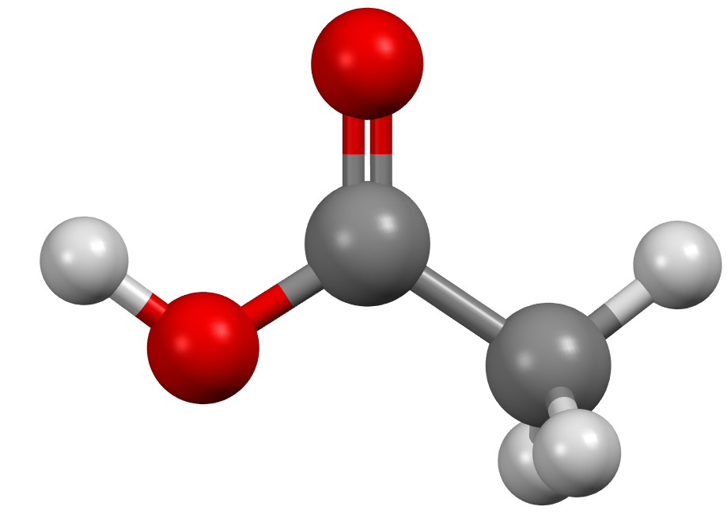
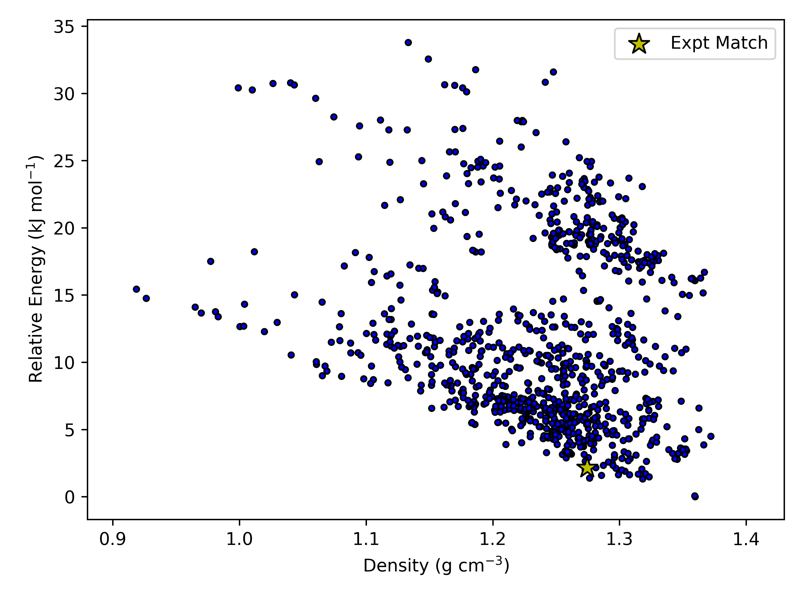

.. _acetic-acid-example:

Crystal structure prediction of Acetic acid
============================================

In this example we will show how to perform a CSP simulation for acetic acid (refcode: ACETAC01)

Step 1: Obtain a geometry file for acetic acid
----------------------------------------------

Typically these should be optimized gas phase conformations, from a
program like Gaussian or otherwise.

The molecular structures to be provided as input can either be drawn 
manually using visualisation software (e.g. Chemcraft, GaussView, Molden etc.), 
or molecules can be extracted from crystal structures in the Cambridge Structural Database (CSD). 
You may also already have sets of XYZ coordinates from e.g. a molecular conformational search.

In the first case, after extracting the XYZ coordinates, a typical input file for Gaussian (given a .com extension) 
would look something like this:

.. code:: text
    
    # METHOD/BASIS-SET opt NoSymm EmpiricalDispersion=GD3BJ

    Geometry optimisation calculation for Acetic Acid

    0 1
    C   2.19748   1.16892   0.98592
    C   1.18991   1.53866   2.00819
    H   2.42242   0.20859  -0.66920
    H   1.70368   2.08590   2.83258
    H   0.43923   2.20860   1.60955
    H   0.70543   0.68712   2.42875
    O   1.71300   0.43968   0.00000
    O   3.36610   1.51453   1.02054

Where METHOD and BASIS-SET are replaced with an approprioate electronic structure theory method 
and basis set (e.g. B3LYP/6-311G**). The first line contains the functional and basis set 
(i.e. the level of theory being applied), the type of calculated (opt - geometry optimisation), 
a command to impose no symmetry on the molecule (nosymm), and a command to add a dispersion 
correction (DFT lacks any description of dispersion -- van der Waals' forces -- so an empirical, 
post hoc correction improves the energy). The third line is a comment line, the fifth line 
gives the charge and multiplicity (number of spin configurations) respectively, 
and the remaining lines give the XYZ coordinates of each atom (in Angstroms).

**The blank lines must be included in the file (including the final blank lines).**

For further information regarding the Gaussian input file structure, we refer you 
to the `Gaussian support page <https://gaussian.com/techsupport/>`_.

From herein, we will assume you have a (relaxed) molecular geometry in XYZ format in the file ``acetic.xyz``.

Step 2: Perform distributed multipole analysis
----------------------------------------------

The distributed multipole analysis can be performed as follows:

.. code:: bash

   cspy-dma acetic.xyz

This will produce the following files:

.. code:: bash

   acetic.mols         # molecular axis definition (NEIGHCRYS/DMACRYS) format
   acetic.dma          # molecular multipoles
   acetic_rank0.dma    # molecular charges in the same format (probably from MULFIT or similar)

Step 3: Perform crystal structure prediction
--------------------------------------------

To perform a local CSP calculation for acetic acid, (sampling the top ten most commonly observed spacegroups) the following command can be used:

.. code:: bash

    mpiexec -np NUM_CORES cspy-csp acetic.xyz -c acetic_rank0.dma -m acetic.dma -a acetic.mols -g fine10

Where ``NUM_CORES`` refers to the number of CPU cores you wish to run the calculation with. This command can also be
incoprorated into a job submission script and used on a HPC facility. An example SLURM submission script for acetic acid is 
given below:

.. code:: bash

   #!/bin/bash
   #SBATCH --nodes=5
   #SBATCH --ntasks-per-node=40
   #SBATCH --time=24:00:00

   cd $SLURM_SUBMIT_DIR

   module load conda/py3-latest
   source activate cspy
   mpiexec cspy-csp molecule.xyz -c molecule_rank0.dma -m molecule.dma -a molecule.mols -g fine10

Once the calculation begins, a set of SQL databases will appear in the working directory. There will be one per spacegroup
and will have the following naming scheme: ``acetic-SG.db`` (SG replaced with the spacegroup number)

Step 4: Remove duplicate structures
-----------------------------------

The database files that are output in step 3 will likely contain many duplicate structures. These arise in situations where
the structure generator creates a number of structures that optimize into the same minimum on the force-field potential energy surface.
We can remove duplicate structures using the following command:

.. code:: bash

   cspy-db cluster acetic-*.db

This will find redundant structures within each of the database files, combine the unique structures into a new database file (defaulting to
``output.db``), then find unique structures within the combined file (i.e. search for duplicates across the different spacegroups).

Step 5: Analyse the Landscape
-----------------------------
Once you have removed duplicate structures you can use the final database to analyse the results. The following command can be used
to create a csv file of the final structures ordered by energy (default). Each structure will also be saved to a compressed archive
in shelx format by default.

.. code:: bash

    usage: cspy-db dump [-h] [-t TABLE_OUTPUT] [-r STRUCTURE_OUTPUT] [-f {cif,res}] [-d] [-e ENERGY] [--parse-metadata] [-s SORT_BY]
               [--log-level {INFO,DEBUG,ERROR,WARN}]
               databases [databases ...]

positional arguments
^^^^^^^^^^^^^^^^^^^^

* ``databases`` - Databases to process.

optional arguments
^^^^^^^^^^^^^^^^^^
* ``-h``, ``--help`` - Show this help message and exit
* ``-t`` ``TABLE_OUTPUT``, ``--table-output`` ``TABLE_OUTPUT``- Name of .csv output file
* ``-r`` ``STRUCTURE_OUTPUT``, ``--structure-output`` ``STRUCTURE_OUTPUT`` - Name of .zip output file
* ``-f`` ``{cif,res}``, ``--structure-filetype {cif,res}``- File type for compressed structures
* ``-d``, ``--include-duplicates``- Dump duplicate structures also
* ``-e`` ``ENERGY``, ``--energy`` ``ENERGY`` - Dump structures that are a within the inputted energy from the global minimum
* ``--parse-metadata`` - Include metadata
* ``-s`` ``SORT_BY``, ``--sort-by`` ``SORT_BY`` - Sort by a specified column (id, spacegroup, density, energy, minimization_step, trial_number, minimization_time, metadata)
* ``--log-level`` ``{INFO,DEBUG,ERROR,WARN}`` - Control level of logging output

We have provided some example python scripts in the :ref:`useful_scripts` section which can be used to visualise the landscape.

Here is an example landscape from one of our simulations of acetic acid:

.. _reoptimize:

Step 6: Reoptimize the final crystal structures (optional)
---------------------------------------------------------

If the user wishes to reoptimize the final crystal structures with different minimization parameters (in this example we will use a larger force-field ``cutoff``), 
the user can employ the ``cspy-reoptimize``. 

After clustering in step 4, the user is left with ``output.db``. To reoptimize the crystal structures in this database, an axis file, xyz file of the molecule,
charges file and multipoles file are needed 

.. code:: bash

   cspy-reoptimize output.db -x acetic.xyz -a acetic.mols -m acetic.dma -c acetic_rank0.dma -p fit --cutoff 30

This will produce a new SQL database which in this example, will have the name ``output.opt.db``.

Alternatively, the user may wish to reoptimize the final crystal structures with a different method all together. Currently, mol-CSPy is able to reoptimise structures
using DMACRYS, PMIN or tight-binding DFT as implemented in the dftb+ software package. In order to perform this kind of calculation, the user needs a ``cspy.toml`` file
with the following:

.. code:: toml

  [[csp_minimization_step]]
  kind = "dftb"

  [dftb]
  max_steps = 2500
  max_force = 0.00058
  kpoint_spacing = 0.05
  scc_tol = 1e-5
  timeout = 3600
  single_point =  false
  atomic_pos_opt =  true
  lattice_and_atoms_opt =  false

Please note that there are a number of different keywords that can be specified under the ``[dftb]`` header. The defaults for these can be found in ``cspy/configuration.py``

The following command is then used to run calculations with dftb+:

.. code:: bash

   cspy-reoptimize output.db --dftb-calc

.. note::
   The user should make sure that the ``dftb+`` command is specified in their ``$PATH`` variable.
