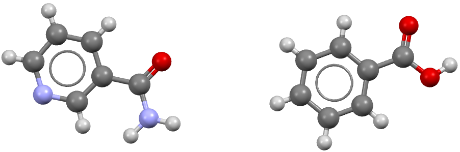

Crystal structure prediction of a Co-crystal
============================================

In this example we will show how to perform a CSP simulation for a 1:1 co-crystal of nicotinamide and benzoic acid  (refcode: GAZCES)

Step 1: Obtain a geometry file for each component
-------------------------------------------------

Typically these should be optimized gas phase conformations, from a
program like Gaussian or otherwise.

For more information, please see the :ref:`acetic-acid-example` example.

Step 2: Perform distributed multipole analysis
----------------------------------------------

Assuming a simple naming scheme has been used for the geometry files, the distributed multipole analysis for the 1:1 co-crystal is performed with the following command:

.. code:: bash

    cspy-dma nicotinamide.xyz benzoic_acid.xyz

This will produce the following files:

.. code:: bash

   nicotinamide.benzoic_acid.mols         # molecular axis definition (NEIGHCRYS/DMACRYS) format
   nicotinamide.benzoic_acid.dma          # molecular multipoles
   nicotinamide.benzoic_acid_rank0dma    # molecular charges in the same format (probably from MULFIT or similar)

Other stoichoiometric ratios can also be calculated. For example, a generic 2:1 co-crystal would be specified as follows:

.. code:: bash

    cspy-dma component_1.xyz component_1.xyz component_2.xyz 

This will produce the following files:

.. code:: bash

   component_1x2.component_2.mols         # molecular axis definition (NEIGHCRYS/DMACRYS) format
   component_1x2.component_2.dma          # molecular multipoles
   component_1x2.component_2_rank0.dma    # molecular charges in the same format (probably from MULFIT or similar)

Step 3: Perform crystal structure prediction
--------------------------------------------

To perform a local CSP calculation for the 1:1 co-crystal of nicotinamide and benzoic acid, (sampling the top ten most commonly observed spacegroups for co-crystals) the following command can be used:

.. code:: bash

    mpiexec -np NUM_CORES cspy-csp nicotinamide.xyz benzoic_acid.xyz -c nicotinamide.benzoic_acid_rank0dma -m nicotinamide.benzoic_acid.dma -a nicotinamide.benzoic_acid.mols -g co_crystalfine

Where ``NUM_CORES`` refers to the number of CPU cores you wish to run the calculation with. One of these will be the controller
and the rest will be worker cores that perform structure generation and minimization tasks. This command can also be
incoprorated into a job submission script and used on a HPC facility. An example SLURM submission script for acetic acid is 
given below:

.. code:: bash

   #!/bin/bash
   #SBATCH --nodes=5
   #SBATCH --ntasks-per-node=40
   #SBATCH --time=24:00:00

   cd $SLURM_SUBMIT_DIR

   module load conda/py3-latest
   source activate cspy
   mpiexec cspy-csp nicotinamide.xyz benzoic_acid.xyz -c nicotinamide.benzoic_acid_rank0dma -m nicotinamide.benzoic_acid.dma -a nicotinamide.benzoic_acid.mols -g co_crystalfine

Step 4: Remove duplicate structures
-----------------------------------

The database files that are output in step 3 will likely contain many duplicate structures. These arise in situations where
the structure generator creates a number of structures that optimize into the same minimum on the force-field potential energy surface.
We can remove duplicate structures using the following command:

.. code:: bash

   cspy-db cluster *.db

This will find redundant structures within each of the database files, combine the unique structures into a new database file (defaulting to
``output.db``), then find unique structures within the combined file (i.e. search for duplicates across the different spacegroups).

Step 5: Analyse the Landscape
-----------------------------
Once you have removed duplicate structures you can use the final database to analyse the results. The following command can be used
to create a csv file of the final structures ordered by energy (default). Each structure will also be saved to a compressed archive
in shelx format by default.

.. code:: bash

    usage: cspy-db dump [-h] [-t TABLE_OUTPUT] [-r STRUCTURE_OUTPUT] [-f {cif,res}] [-d] [-e ENERGY] [--parse-metadata] [-s SORT_BY]
               [--log-level {INFO,DEBUG,ERROR,WARN}]
               databases [databases ...]

positional arguments
^^^^^^^^^^^^^^^^^^^^

* ``databases`` - Databases to process.

optional arguments
^^^^^^^^^^^^^^^^^^
* ``-h``, ``--help`` - Show this help message and exit
* ``-t`` ``TABLE_OUTPUT``, ``--table-output`` ``TABLE_OUTPUT``- Name of .csv output file
* ``-r`` ``STRUCTURE_OUTPUT``, ``--structure-output`` ``STRUCTURE_OUTPUT`` - Name of .zip output file
* ``-f`` ``{cif,res}``, ``--structure-filetype {cif,res}``- File type for compressed structures
* ``-d``, ``--include-duplicates``- Dump duplicate structures also
* ``-e`` ``ENERGY``, ``--energy`` ``ENERGY`` - Dump structures that are a within the inputted energy from the global minimum
* ``--parse-metadata`` - Include metadata
* ``-s`` ``SORT_BY``, ``--sort-by`` ``SORT_BY`` - Sort by a specified column (id, spacegroup, density, energy, minimization_step, trial_number, minimization_time, metadata)
* ``--log-level`` ``{INFO,DEBUG,ERROR,WARN}`` - Control level of logging output

We have provided some example python scripts in the :ref:`useful_scripts` section which can be used to visualise the landscape.