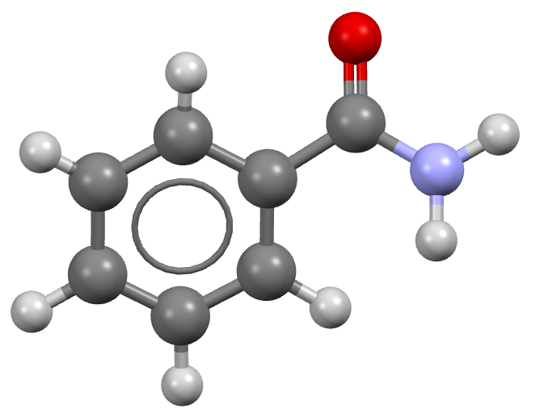

.. _qrbh:

Quasi-random basin hopping (QRBH) simulation of benzamide
=========================================================

Step 1: Obtain a geometry file for benzamide
--------------------------------------------

Typically these should be optimized gas phase conformations, from a
program like Gaussian or otherwise.

For more information, please see the :ref:`acetic-acid-example` example.

Step 2: Perform distributed multipole analysis
----------------------------------------------

The distributed multipole analysis can be performed as follows:

.. code:: bash

    cspy-dma benzamide.xyz

This will produce the following files:

.. code:: bash

   benzamide.mols         # molecular axis definition (NEIGHCRYS/DMACRYS) format
   benzamide.dma          # molecular multipoles
   benzamide_rank0.dma    # molecular charges in the same format (probably from MULFIT or similar)

Step 3: Configure the TOML file
-------------------------------

In order for the ``cspy-qrbh`` command to receive settings for the monte-carlo basin hopping, 
the user must supply a ``cspy.toml`` file such as the one below:

.. code:: toml

    [mc]
    initial_temper = 3000.0            # Temperature for basin hopping
    num_steps = 100                    # Number of maximum steps for one basin hopping trial (infinite with continue_running=True)
    num_trials = 500                   # Number of basin hopping trials
    sat_expand = false                 # Whether to use SAT to expand the cell after perturbation
    move_all = false                   # Whether to apply all available types of move at one perturbation
    auto_prob = true                   # Calculate probability of choosing move type according to degrees of freedom
    continue_running = false           # If True, trial will keep running even after finishing
    auto_cutoff = true                 # Calculate cutoff of move type, currently only applied to volume expansion and contraction based on number of molecules in unit cell 
    on_the_fly = true                  # Whether to use on-the-fly duplicate structure removal, if True, continue_running will always be False 
    move = [
        [ "tra", "0.0", "4",],
        [ "rot", "0.0", "0.4",],
        [ "u_a", "0.0", "4",],
        [ "u_l", "0.0", "4",],
        [ "vol", "0.0", "80",],]       # Specifies the type of pertubations

    [basin_hopping]
    basin_hopping = true               # Minimize after perturbation, meaningless here
    dump_accept = true                 # Only dump accepted structures if True
    raw_structure = true               # Perturb from unminimized structure if True
    niggli_cell = true                 # Calculate Niggli cell after pertubation

The ``move`` parameter is used to specify the types of pertubations that may be selected during the Monte Carlo simulation.
Its input is a ``list`` of lists where each sublist contains: the move type (``tra`` = molecule translation, 
``rot`` = molecule rotation, ``u_a`` = unit cell angle change, ``u_l`` = unit cell length change, ``vol`` = unit cell volume change, 
``ref`` = reflect a molecule through a plane), the move choice probability, and the cut-off value i.e. the maximum magnitude possible 
for that move. If the move choice probabilities are 0 or ``auto_prob`` is true, then the probabilities will be calculated as the proportion 
of the total degrees of freedom. 

Step 4: Perform the QRBH simulation
-----------------------------------

To perform a local QRBH calculation for benzamide, (sampling the top ten most commonly observed spacegroups) the following command can be used:

.. code:: bash

    mpiexec -np NUM_CORES cspy-qrbh benzamide.xyz -c benzamide_rank0.dma -m benzamide.dma -a benzamide.mols -g fine10

Where ``NUM_CORES`` refers to the number of CPU cores you wish to run the calculation with. This command can also be
incoprorated into a job submission script and used on a HPC facility. An example SLURM submission script is given below:

.. code:: bash

   #!/bin/bash
   #SBATCH --nodes=5
   #SBATCH --ntasks-per-node=40
   #SBATCH --time=24:00:00

   cd $SLURM_SUBMIT_DIR

   module load conda/py3-latest
   source activate cspy
   mpiexec cspy-qrbh benzamide.xyz -c benzamide_rank0.dma -m benzamide.dma -a benzamide.mols -g fine10

Once the calculation begins, a set of SQL databases will appear in the working directory. There will be one per spacegroup
and will have the following naming scheme: ``benzamide-SG.db`` (SG replaced with the spacegroup number)

There will also be a ``status.txt`` file. Below is an example shown from a test simulation involving a single space group:

.. code:: text

      target valid qr_fail invalid  seed running       ttime      mtime valid_min invalid_min unique_min target_trial active_trial truncate_trial finish_trial
    9  10000  2768    5420    5602  8371       0  1093710.68  595800.09     10289         549       6884          500          166           2602            0

    39 MPI workers. ETA: 0d 20h 21m 10s

* 1st column is the spacegroup number
* ``target`` is the number of valid structures that were requested
* ``valid`` is the number of valid structures that have been obtained by the quasi-random crystal structure generation step
* ``qr_fail`` is the number of trial crystal structures that failed the quasi-random crystal structure generation step
* ``invalid`` number of trial crystal structures that passed the quasi-random crystal structure generation step but failed the subsequent minimization step.
* ``seed`` is the maximum sobol seed that has been used so far
* ``running`` is the number of active tasks in the work queue  
* ``ttime`` is the total amount of time in seconds that the workers have spent on quasi-random crystal structure generation and structure minimzation tasks
* ``mtime`` is the total amount of tie in seconds that the workers have spent on successful structure minimization tasks
* ``valid_min`` is the number of valid structures that have been minimized after quasi-random structure generation and basin hopping monte carlo simulations
* ``invalid_min`` is the number of structures that have failed to geometry optimize after the basin hopping monte carlo simulation
* ``unique_min`` is the number of unique minima which are found by performing on-the-fly clustering after basin hopping monte carlo simulations.
* ``target_trial`` is the number of basin hopping trials that was requested in the ``cspy.toml`` file
* ``active_trial`` is the number of basin hopping trials that are currently running
* ``truncate_trial`` is the number of basin hopping trials that were truncated before completion (this can occur if a duplicate structure is found by on-the-fly clustering)
* ``finish_trial`` is the number of basin hopping trials that are complete

.. note::

    Quasi-random generated structures will be found first and then basin hopping trajectories are run from these. 
    ``valid`` in the 2nd column shows the number of Quasi-random generated structures where as ``valid_min`` shows 
    the number of structrues generated from the quasi-random step and basin hopping step. Therefore, ``valid`` can
    ``truncate_trial`` + ``finish_trial`` + ``active_trial``

Step 5: Remove duplicate structures
-----------------------------------

The database files that are output in step 4 will likely contain many duplicate structures. We can remove duplicate structures 
using the following command:

.. code:: bash

   cspy-db cluster *.db

This will find redundant structures within each of the database files, combine the unique structures into a new database file (defaulting to
``output.db``), then find unique structures within the combined file (i.e. search for duplicates across the different spacegroups).

Step 6: Analyse the Landscape
-----------------------------
Once you have removed duplicate structures you can use the final database to analyse the results. The following command can be used
to create a csv file of the final structures ordered by energy (default). Each structure will also be saved to a compressed archive
in shelx format by default.

.. code:: bash

    usage: cspy-db dump [-h] [-t TABLE_OUTPUT] [-r STRUCTURE_OUTPUT] [-f {cif,res}] [-d] [-e ENERGY] [--parse-metadata] [-s SORT_BY]
               [--log-level {INFO,DEBUG,ERROR,WARN}]
               databases [databases ...]

positional arguments
^^^^^^^^^^^^^^^^^^^^

* ``databases`` - Databases to process.

optional arguments
^^^^^^^^^^^^^^^^^^
* ``-h``, ``--help`` - Show this help message and exit
* ``-t`` ``TABLE_OUTPUT``, ``--table-output`` ``TABLE_OUTPUT``- Name of .csv output file
* ``-r`` ``STRUCTURE_OUTPUT``, ``--structure-output`` ``STRUCTURE_OUTPUT`` - Name of .zip output file
* ``-f`` ``{cif,res}``, ``--structure-filetype {cif,res}``- File type for compressed structures
* ``-d``, ``--include-duplicates``- Dump duplicate structures also
* ``-e`` ``ENERGY``, ``--energy`` ``ENERGY`` - Dump structures that are a within the inputted energy from the global minimum
* ``--parse-metadata`` - Include metadata
* ``-s`` ``SORT_BY``, ``--sort-by`` ``SORT_BY`` - Sort by a specified column (id, spacegroup, density, energy, minimization_step, trial_number, minimization_time, metadata)
* ``--log-level`` ``{INFO,DEBUG,ERROR,WARN}`` - Control level of logging output

We have provided some example python scripts in the :ref:`useful_scripts` section which can be used to visualise the landscape.