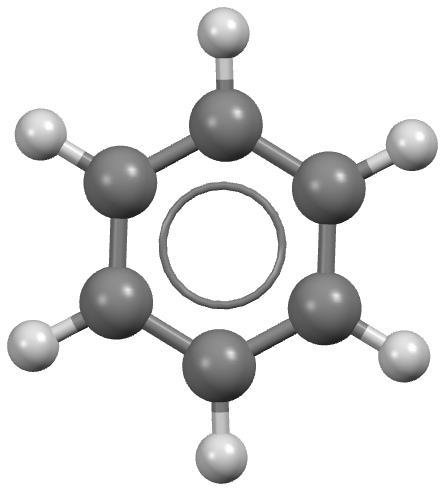

.. _threshold-example:

Threshold simulation for Benzene
================================

Step 1: Obtain a geometry file for Benzene
------------------------------------------

Typically these should be optimized gas phase conformations, from a
program like Gaussian or otherwise.

For more information, please see the :ref:`acetic-acid-example` example.

Step 2: Perform distributed multipole analysis
----------------------------------------------

The distributed multipole analysis can be performed as follows:

.. code:: bash

    cspy-dma benzene.xyz

This will produce the following files:

.. code:: bash

   benzene.mols         # molecular axis definition (NEIGHCRYS/DMACRYS) format
   benzene.dma          # molecular multipoles
   benzene_rank0.dma    # molecular charges in the same format (probably from MULFIT or similar)

Step 3: Configure the TOML file
-------------------------------

Below is an example contents of the ``cspy.toml`` file for this simulation.

.. code:: toml
    
    csp_minimization_step = [
    { kind = "dmacrys", electrostatics = "multipoles" },
    { kind = "dmacrys", CONP = true, PRES = "0.1 GPa", electrostatics = "multipoles"},
    { kind = "dmacrys", electrostatics = "multipoles" },
    ]

    [mc]
    num_steps = 100
    move = [
        [ "tra", "0.0", "0.5"], 
        [ "rot", "0.0", "0.05"], 
        [ "u_a", "0.0", "0.5"], 
        [ "u_l", "0.0", "0.5"], 
        [ "vol", "0.0", "25"]
    ]
    move_scale = 1.0
    move_all = false
    auto_prob = true
    auto_cutoff = true

    [basin_hopping]
    dump_accept = false

    [threshold]
    interval_para = [ "fixed", "10", ]
    increase_para = [ "fixed", "5.0", ]
    minimize = true

    [dmacrys]
    timeout = 200.0

``[csp_minimization_step]`` - This section contains a list of dictionaries which individually describe a minimization step. In the above example, 
there are three lattice energy minimzation steps performed by DMACRYS. All steps use an anisotropic atom–atom force-field energy model 
plus electrostatic interactions described by a multipole series (up to hexadecapole) using distributed multipole analysis. The difference in step 2 
from the other steps is that an external pressure of 0.1 GPa is applied.

``[mc]`` & ``[basin hopping]`` - These sections contain settings for the Monte Carlo simulation that are used in both threhold and QRBH simulations.
``num_steps`` is the total length of the simulation is 100 steps (accepted and rejected).  ``move`` is used to define the moveset by a list of lists 
with each sublist specifying a movetype and its parameters. The first param of a move is its type, the available types are: molecular translation (``tra``),
molecular rotation (``rot``), unit cell angles (``u_a``), unit cell lengths (``u_l``), and unit cell volume (``vol``). The second parameter is the
selection probability. If the probabilities are 0 or ``auto_prob`` is true then the probabilities will be calculated as the proportion of the total degrees of freedom. 
The third parameter is the cutoff for the move, i.e. the maximum magnitude possible for that move. The units for each move are as follows: translation is Å, 
rotation is degrees, volume is Å^{3}. The auto_cutoff option scales the volume cutoff based on the number of molecules in the unit cell.
``move_scale`` scales the cutoffs by a scalar each time the energy lid is increased. ``move_all`` is used to specify whether to apply all available types of move 
at one perturbation or to apply each move as a single pertubation. Finally, the ``dump_accept`` keyword in the ``[basin_hopping]`` section is used to
only dump accepted structures if set to true.

``[threhold]`` - This section is used to set the energy threhold and steps per lid. Here, ``interval_para`` is the number of steps per energy threshold/lid. 
The first parameter specifies the type strategy, e.g. ``fixed`` means same number of steps each energy lid. Likewise, ``increase_para`` is the energy increase 
between energy thresholds, e.g. increases 5.0 kJ/mol each iteration. Again the first parameter determines the strategy. The total number of lids is determined 
by dividing the num_steps by the interval_para steps. The ``minimize`` option sets whether to do the minimization of the accepted structures concurrently. If 
running many trajectories, it can be more efficient to just do the MC trajectories by themselves using 1 core per trajectory and then do the optimizations 
afterwards using large scale parallelisation (e.g. using ``cspy-reoptimize``). Minimizing the accepted structures is essential since this is how we determine 
what minima are sampled during the trajectory. Typically, we want the same energy surface throughout, i.e. the minimization steps in the ``cspy.toml`` should 
be the same (though including a pressure step is good since high energy structures sampled during the threshold simulation can often exhibit vacuum gaps between layers).

``[dmacrys]`` - This section is used to specify settings for the DMACRYS program. In this example, it is used to modify the timeout which
tells DMACRYS how long to perform a calculation before stopping and moving on to another calculation.

Step 4: Obtaining a starting crystal structure of benzene
---------------------------------------------------------

The threshold algorithm is usually initiated several local minima on the energy landscape and therefore requires input crystal structures for benzene.
In this example, we demonstrate using a single crystal structure - ``benzene_form_III_csp_P1.res`` corresponding to the high pressure form III polymorph
of benzene as found after performing crystal structure prediction. It is important that the initial crystal structures are converted to P1 symmetry. 
This can be achieved with the following python script:

.. code:: python

    from cspy.crystal import Crystal
    import sys

    crystal = Crystal.load(sys.argv[1])
    p1_crystal = crystal.as_P1()
    p1_crystal.save(sys.argv[2])

The python script is then run on the command line:

.. code:: bash

    python SCRIPT.py input_structure output_structure

Where ``input_structure`` is the input SHELX or CIF crystal structure and ``output_structure`` is the filename you want to save the P1 structure to. The file extension
used on ``output_structure`` will dictate the type of file that is written (i.e. ``.res`` will be a SHELX file and ``.cif`` will be a CIF file.)

Below is the file contents of ``benzene_form_III_csp_P1.res``.

.. code:: text

    TITL benzene_form_III_csp-P1-1-1-1
    CELL 0.7 8.0828 5.5371 5.6702 90 71.6477 90
    LATT -1
    SFAC C H
    C1    1       0.742101910000       0.332654780000       0.330318380000
    C2    1       0.640453210000       0.312381590000       0.578596760000
    C3    1       0.851634060000       0.531097440000       0.251713210000
    C4    1       0.648362810000       0.490526050000       0.748280230000
    C5    1       0.859550100000       0.709251950000       0.421390990000
    C6    1       0.757901400000       0.688978750000       0.669669360000
    H1    2       0.735965720000       0.194028970000       0.198294610000
    H2    2       0.555227380000       0.158003620000       0.639830350000
    H3    2       0.930733010000       0.546864180000       0.058529300000
    H4    2       0.569263860000       0.474759320000       0.941464150000
    H5    2       0.944775480000       0.863618510000       0.360178410000
    H6    2       0.764036190000       0.827588620000       0.801697560000
    C7    1       0.257898090000       0.832654780000       0.669681620000
    C8    1       0.359546790000       0.812381590000       0.421403240000
    C9    1       0.148365940000       1.031097440000       0.748286790000
    C10   1       0.351637190000       0.990526050000       0.251719770000
    C11   1       0.140449900000       1.209251950000       0.578609010000
    C12   1       0.242098600000       1.188978750000       0.330330640000
    H7    2       0.264034280000       0.694028970000       0.801705390000
    H8    2       0.444772620000       0.658003620000       0.360169650000
    H9    2       0.069266990000       1.046864180000       0.941470700000
    H10   2       0.430736140000       0.974759320000       0.058535850000
    H11   2       0.055224520000       1.363618510000       0.639821590000
    H12   2       0.235963810000       1.327588620000       0.198302440000

Step 5: Running the threshold calculation
-----------------------------------------

The threshold calculation can be run on a SLURM cluster with the following script:

.. code:: bash

    #!/bin/bash
    #SBATCH --nodes=5
    #SBATCH --ntasks-per-node=40
    #SBATCH --time=24:00:00

    cd $SLURM_SUBMIT_DIR

    source ~/.bashrc
    conda activate cspy
    mpiexec cspy-threshold benzene.xyz -r  benzene_form_III_csp_P1.res -a benzenex2.mols -m benzenex2.dma -c benzenex2_rank0.dma  -g 1 --trials-per-res 1

.. note::
    A space group flag (``-g``) is currently required, however, this does not actually determine
    the space group sampled (that is determined by the space group of the
    crystal files). This flag simply determines the space group label in the
    structure ids.  
    Generally, all threshold simulations should be done in P1 since any space group symmetry
    represents a constraint on the transitions that can be sampled and so
    leads to overestimating the lowest energy connection, i.e. remember to
    convert your crystals to P1 before running threshold simulations.

    For convergence, it can be useful to have multiple trajectories/trials
    per structure. This is set with the ``--trials-per-res`` option.

This will produce a database file ``benzene-1.db`` which stores crystal structures from the threshold simulation 
and ``status.txt``. The contents of ``status.txt`` looks similar to this at the beginning of the simulation:

.. code:: text

    target perturb accept reject valid invalid running target_trial active_trial finish_trial unique_min ttime mtime
  1    100       1      0      1     1       0       0            1            1            0          0  9.84  8.42

* ``target`` - The requested number of simulation steps
* ``perturb`` - The number of pertubations that have been carried out
* ``accept`` - The number of accepted pertubations
* ``reject`` - The number of rejected pertubations
* ``valid`` - The number of valid optimisations
* ``invalid`` - The number of invalid optimisations
* ``running`` - The number of running jobs (currently always reads 0 but iwll be fixed in next update)
* ``target_trial`` - The requested number of trials/trajectories 
* ``active_trial`` - The number of running trials/trajectories
* ``finish_trial`` - The number of complete trials/trajectories
* ``unique_min`` - The number of unique structures
* ``ttime`` - The total time
* ``mtime`` - The minimization time

Step 6: Generating the Disconnectivity Graph
--------------------------------------------

Firstly, the output database (``benzene-1.db``) must be clustered.

.. code:: bash

   cspy-db cluster benzene-1.db

If the user has access to the CSD python API, we recommend following this 
up with COMPACK clustering.

.. code:: bash

   cspy-db cluster -cfe -m compack benzene-1.db

The disconnectivity graph is then generated using the :ref:`threshold_utils`:

.. code:: bash

    cspy-threshold-utils disconn benzene-1.db 

The script is ran on the clustered original database (NOT the output 
database! this does not contain the trajectory information and so will not work).
